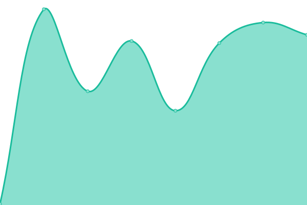
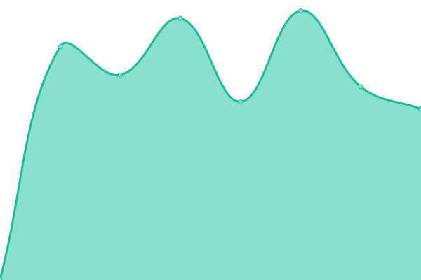
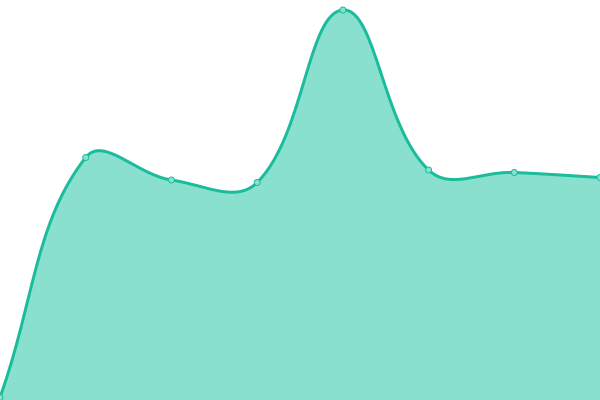
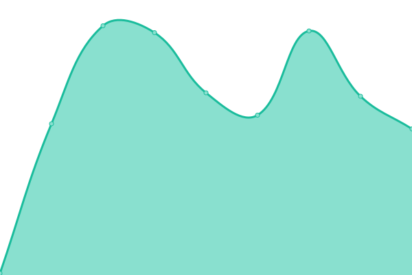
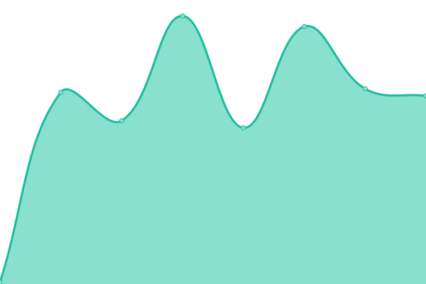
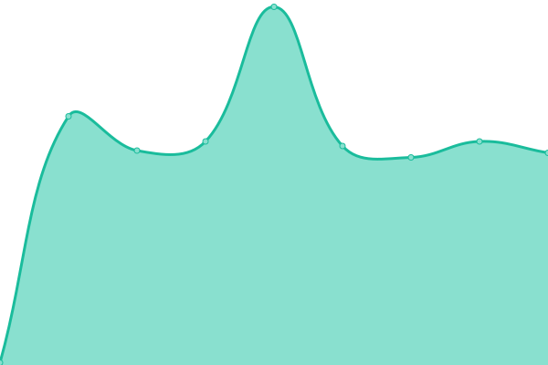
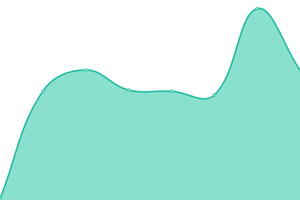
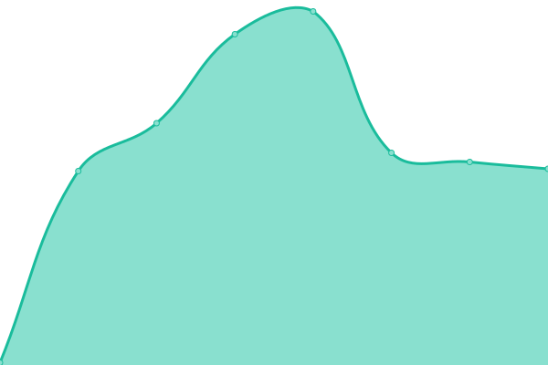

# [📈 Live Status](https://status.codergames.de): <!--live status--> **🟥 Complete outage**

This repository contains the open-source uptime monitor and status page for [Codergamesde](https://status.codergames.de), powered by [Upptime](https://github.com/upptime/upptime).

With [Upptime](https://upptime.js.org), you can get your own unlimited and free uptime monitor and status page, powered entirely by a GitHub repository. We use [Issues](https://github.com/Codergamesde/status.codergames.de/issues) as incident reports, [Actions](https://github.com/Codergamesde/status.codergames.de/actions) as uptime monitors, and [Pages](https://status.codergames.de) for the status page.

<!--start: status pages-->
<!-- This summary is generated by Upptime (https://github.com/upptime/upptime) -->
<!-- Do not edit this manually, your changes will be overwritten -->
<!-- prettier-ignore -->
| URL | Status | History | Response Time | Uptime |
| --- | ------ | ------- | ------------- | ------ |
|  [Codergames Website](https://codergames.de) | 🟥 Down | [codergames-website.yml](https://github.com/Codergamesde/status.codergames.de/commits/HEAD/history/codergames-website.yml) | 

 473ms
     
 | 

<a href="https://status.codergames.de/history/codergames-website">92.30%</a>
    

|  [Codergames Download](https://download.codergames.de) | 🟥 Down | [codergames-download.yml](https://github.com/Codergamesde/status.codergames.de/commits/HEAD/history/codergames-download.yml) | 

 467ms
     
 | 

<a href="https://status.codergames.de/history/codergames-download">92.31%</a>
    

|  [Mail-Server](https://mail.codergames.de/) | 🟥 Down | [mail-server.yml](https://github.com/Codergamesde/status.codergames.de/commits/HEAD/history/mail-server.yml) | 

 539ms
     
 | 

<a href="https://status.codergames.de/history/mail-server">99.90%</a>
    

|  [Mail-Server (SMTP)](mail.codergames.de) | 🟥 Down | [mail-server-smtp.yml](https://github.com/Codergamesde/status.codergames.de/commits/HEAD/history/mail-server-smtp.yml) | 

 96ms
     
 | 

<a href="https://status.codergames.de/history/mail-server-smtp">99.91%</a>
    

|  [Mail-Server (SMTPS)](mail.codergames.de) | 🟥 Down | [mail-server-smtps.yml](https://github.com/Codergamesde/status.codergames.de/commits/HEAD/history/mail-server-smtps.yml) | 

 96ms
     
 | 

<a href="https://status.codergames.de/history/mail-server-smtps">99.92%</a>
    

|  [Mail-Server (Submission)](mail.codergames.de) | 🟥 Down | [mail-server-submission.yml](https://github.com/Codergamesde/status.codergames.de/commits/HEAD/history/mail-server-submission.yml) | 

 96ms
     
 | 

<a href="https://status.codergames.de/history/mail-server-submission">99.94%</a>
    

|  [Mail-Server (IMAP)](mail.codergames.de) | 🟥 Down | [mail-server-imap.yml](https://github.com/Codergamesde/status.codergames.de/commits/HEAD/history/mail-server-imap.yml) | 

 96ms
     
 | 

<a href="https://status.codergames.de/history/mail-server-imap">99.95%</a>
    

|  [Mail-Server (IMAPS)](mail.codergames.de) | 🟥 Down | [mail-server-imaps.yml](https://github.com/Codergamesde/status.codergames.de/commits/HEAD/history/mail-server-imaps.yml) | 

 96ms
     
 | 

<a href="https://status.codergames.de/history/mail-server-imaps">99.96%</a>
    

|  [Mail-Server (POP3)](mail.codergames.de) | 🟥 Down | [mail-server-pop-3.yml](https://github.com/Codergamesde/status.codergames.de/commits/HEAD/history/mail-server-pop-3.yml) | 

 96ms
     
 | 

<a href="https://status.codergames.de/history/mail-server-pop-3">99.97%</a>
    

|  [Mail-Server (POP3S)](mail.codergames.de) | 🟥 Down | [mail-server-pop-3-s.yml](https://github.com/Codergamesde/status.codergames.de/commits/HEAD/history/mail-server-pop-3-s.yml) | 

 96ms
     
 | 

<a href="https://status.codergames.de/history/mail-server-pop-3-s">99.99%</a>
    

|  [Mail-Server (ManageSieve)](mail.codergames.de) | 🟥 Down | [mail-server-manage-sieve.yml](https://github.com/Codergamesde/status.codergames.de/commits/HEAD/history/mail-server-manage-sieve.yml) | 

 96ms
     
 | 

<a href="https://status.codergames.de/history/mail-server-manage-sieve">100.00%</a>
    

<!--end: status pages-->

[**Visit our status website →**](https://status.codergames.de)

## 📄 License

- Powered by: [Upptime](https://github.com/upptime/upptime)
- Code: [MIT](./LICENSE) © [Anand Chowdhary](https://anandchowdhary.com), supported by [Pabio](https://pabio.com)
- Data in the `./history` directory: [Open Database License](https://opendatacommons.org/licenses/odbl/1-0/)
